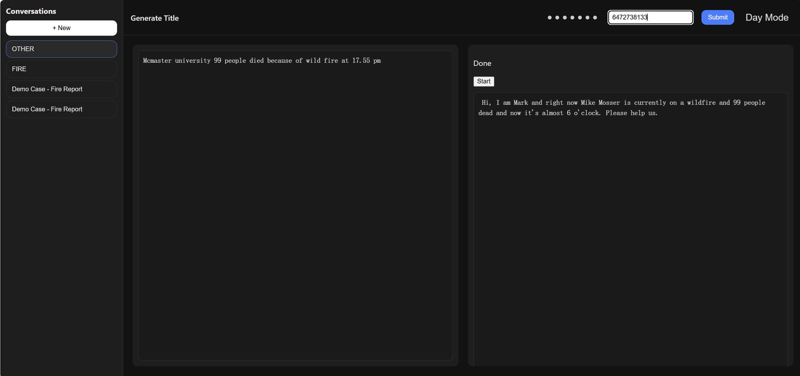
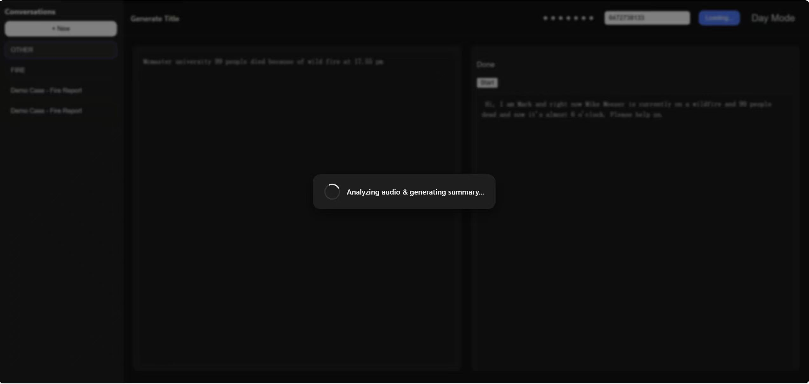
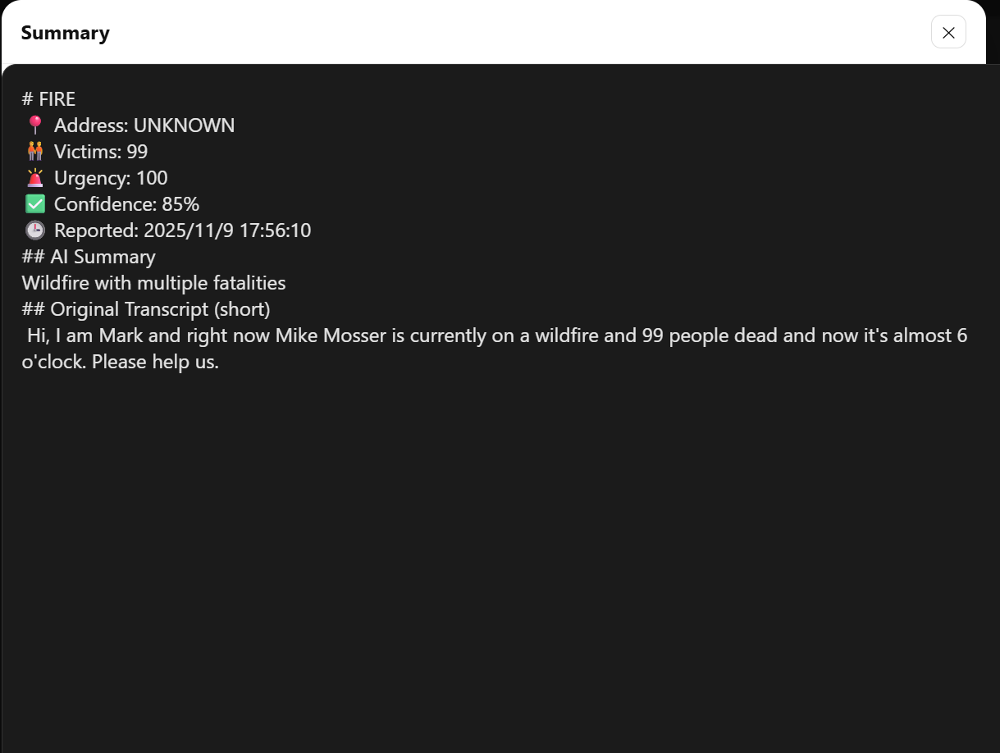
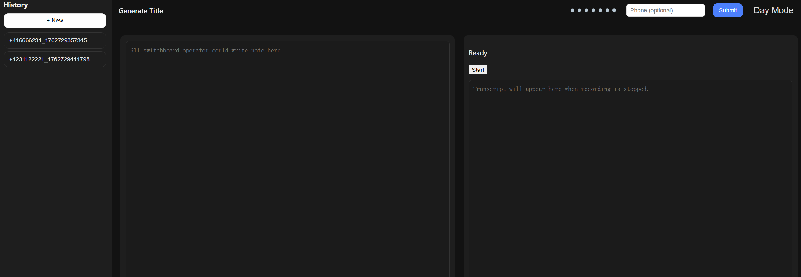
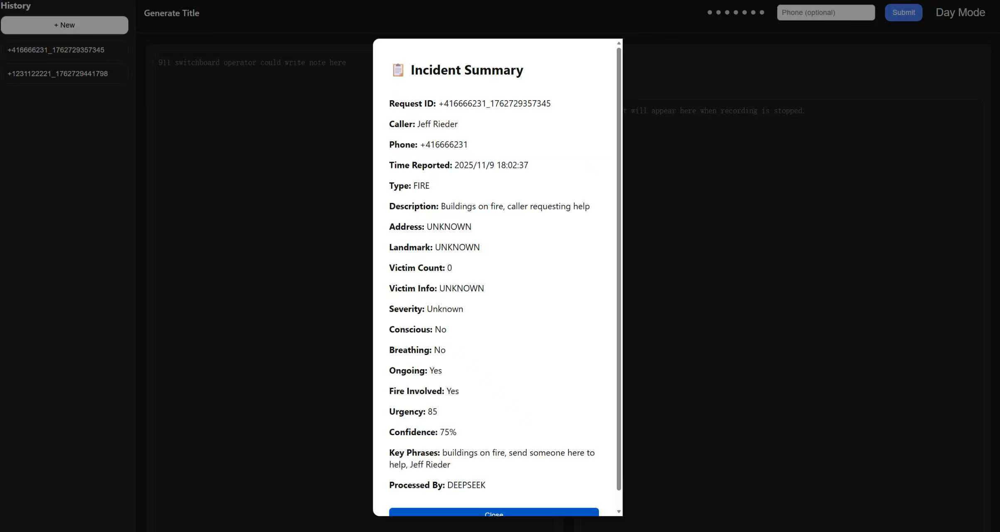

# MEC-EchoTeam: Emergency AI Assistant  
> “When disaster strikes, we don’t panic — we deploy.”  

## Authors

**ZiDi Yao**, **Ke Ma**, **ZhiCong Lin**

McMaster University • Sun NOV 9 2025  


## Tech Stack

| Layer | Technologies |
|:------|:-------------|
| **Frontend** | React • JavaScript • CSS |
| **Backend** | Java • Spring Boot 3.5.7 • DeepSeek API • H2 Database |
| **Runtime** | JDK 17 • Node.js 20.19.4 • npm 10.8.2 |


## Current Stage

Right now, only **DeepSeek API** is enabled (because OpenAI tokens are priced like caviar 🐟).  
You Must upload the phone Number !!!!! 

---

## Setup Guide

### 1. Backend Setup (Spring Boot)

#### Requirements
- Java **JDK 17+**
- Maven (optional if using IDE run config)
- Spring Boot version **3.5.7**
- noode: **20.19.4**
- npm: **10.8.2**

#### Run Command ( Backend) 
./mvnw spring-boot:run  
( It meight be slightly different between Mac and Windows, But I know you will fix it !) 

### Run Command (FrontEnd) 
-npm install  
-npm start


 --- 
 If you just want to test the backend with Postman, here is the example  

## Endpoint

```
POST http://localhost:8080/api/analyze
```


## Example Request #1 — Fire Emergency

```json
{
  "transcript": "Caller says there is a fire in the basement, people might be trapped.",
  "phoneNumber": "+12025551234",
  "timeReported": "2025-11-09T14:00:00Z"
}
```

**Expected Behavior:**
- Detects a **fire emergency**.
- Fills in missing optional fields as `"UNKNOWN"`.
- Uses default LLM model from `mec.llm.active` configuration.

---

## Example Request #2 — Multi-Vehicle Collision

```json
{
  "transcript": "Hello, this is Sarah calling from downtown Toronto. There has been a serious multi-vehicle collision near the intersection of King Street and Spadina Avenue. One car is on fire, another vehicle flipped over, and there are at least three people injured. One man seems unconscious and not breathing, and two others have visible bleeding wounds. The traffic is completely blocked, and smoke is spreading fast. Please send emergency responders immediately.",
  "phoneNumber": "+16475551234",
  "timeReported": "2025-11-09T14:32:00Z"
}
```

**Expected Behavior:**
- Recognizes a **traffic accident** with fire and multiple victims.
- Extracts structured fields such as:
  - `incidentType`: `"TRAFFIC_ACCIDENT"`
  - `victimCount`: `3`
  - `isFire`: `true`
  - `urgencyLevel`: `95`
- Adds normalized metadata:
  - Auto-generated `requestId`
  - Default-safe `UNKNOWN` fields
  - `processedBy`: model name (e.g., `DEEPSEEK`)

---

## Additional Info

- All timestamps **must** use ISO-8601 format (e.g., `2025-11-09T14:00:00Z`).
- If `timeReported` is missing, the backend automatically sets it to the current time.
- You can specify a provider manually via:
  - **Header:** `X-LLM-Provider: DEEPSEEK`
  - or **Query Parameter:** `?provider=CHATGPT`

---

## 1. Layout Overview

These screenshots show the structure and user flow of the system interface.

| Layout | Description |
|---------|--------------|
|  | Main interface — home screen and input section. |
|  | Data Processing by LLM |
|| The result return|
|| The history example01|
|| The history example02, which is more detailed|

---


